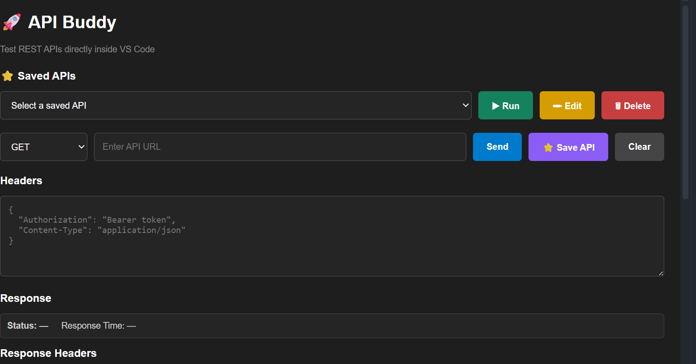

# 🚀 API Buddy

A lightweight REST API testing extension for Visual Studio Code that allows developers to test APIs directly inside VS Code without switching to external API testing tools.

## 📸 Screenshot



---

## ✨ Features

- 🚀 Test REST APIs directly inside VS Code
- 🔹 GET requests
- 🔹 POST requests
- 🔹 PUT requests
- 🔹 PATCH requests
- 🔹 DELETE requests
- 📝 Add custom request headers
- 📦 Send JSON request bodies
- 📊 Display HTTP response status
- ⏱️ Display response time
- 📋 Display response headers
- 📄 Display response body
- ⭐ Save frequently used APIs
- ▶️ Run saved APIs
- ✏️ Edit saved APIs
- 🗑️ Delete saved APIs
- 🧹 Clear request and response data

---

## 🎯 Project Objective

API Buddy is designed to make API testing easier for developers by providing a lightweight REST API testing interface directly inside Visual Studio Code.

Instead of switching between VS Code and external tools such as API testing applications, developers can send requests, view responses, and manage frequently used APIs from one place.

---

## 🏗️ Architecture

```text
                    ┌───────────────────┐
                    │      Developer    │
                    └─────────┬─────────┘
                              │
                              ▼
                    ┌───────────────────┐
                    │    API Buddy UI   │
                    │      ui.html      │
                    └─────────┬─────────┘
                              │
                       postMessage()
                              │
                              ▼
                    ┌───────────────────┐
                    │    extension.js   │
                    │ VS Code Extension │
                    └─────────┬─────────┘
                              │
                       HTTP Request
                              │
                              ▼
                    ┌───────────────────┐
                    │      REST API     │
                    └─────────┬─────────┘
                              │
                      HTTP Response
                              │
                              ▼
                    ┌───────────────────┐
                    │    extension.js   │
                    └─────────┬─────────┘
                              │
                       postMessage()
                              │
                              ▼
                    ┌───────────────────┐
                    │    API Buddy UI   │
                    │ Response Display  │
                    └───────────────────┘
```

---

## 🔄 Request Flow

The API request follows this process:

```text
User
  │
  ▼
Select HTTP Method
  │
  ▼
Enter API URL
  │
  ▼
Add Headers / Body
  │
  ▼
Click Send
  │
  ▼
ui.html
  │
  ▼
extension.js
  │
  ▼
REST API
  │
  ▼
HTTP Response
  │
  ▼
extension.js
  │
  ▼
ui.html
  │
  ▼
Display Response
```

---

## 🔗 Communication Between UI and Extension

API Buddy uses the VS Code Webview messaging system to communicate between the user interface and the VS Code extension.

The communication works through:

```text
ui.html
   │
   │ postMessage()
   ▼
extension.js
   │
   │ HTTP request
   ▼
REST API
   │
   │ HTTP response
   ▼
extension.js
   │
   │ postMessage()
   ▼
ui.html
```

This allows the frontend interface and the extension logic to work together.

---

## 📁 Project Structure

```text
api-buddy/
│
├── extension.js
├── package.json
├── ui.html
├── README.md
├── .gitignore
└── IMAGE.png
```

### File Description

| File | Description |
|------|-------------|
| `extension.js` | Contains the VS Code extension logic |
| `ui.html` | Contains the API Buddy user interface |
| `package.json` | Contains extension configuration and metadata |
| `README.md` | Project documentation |
| `.gitignore` | Specifies files that should not be tracked by Git |
| `IMAGE.png` | Project interface screenshot |

---

## 🛠️ Technologies Used

| Technology | Purpose |
|------------|---------|
| HTML | User interface structure |
| CSS | User interface styling |
| JavaScript | Application and extension logic |
| VS Code API | VS Code extension integration |
| REST API | API communication |
| Git | Version control |
| GitHub | Source code management |

---

## 💻 Requirements

Before running API Buddy, make sure you have:

- Visual Studio Code
- Git
- A REST API to test
- Basic knowledge of HTTP methods

---

## ▶️ How to Run in VS Code

### 1. Clone the repository

```bash
git clone https://github.com/shraddha-shetty20/API-BUDDY.git
```

### 2. Open the project

```bash
cd API-BUDDY
code .
```

### 3. Install dependencies

If dependencies are required, run:

```bash
npm install
```

### 4. Start the Extension Development Host

Open the project in VS Code and press:

```text
F5
```

VS Code will open a new **Extension Development Host** window.

### 5. Open API Buddy

Open the Command Palette:

```text
Ctrl + Shift + P
```

Search for:

```text
API Buddy
```

Select the API Buddy command.

---

## 🧪 Example API Request

### GET Request

```text
GET https://jsonplaceholder.typicode.com/posts/1
```

### POST Request

```text
POST https://jsonplaceholder.typicode.com/posts
```

Example JSON body:

```json
{
  "title": "API Buddy",
  "body": "Testing REST APIs",
  "userId": 1
}
```

---

## 📋 Request Components

API Buddy provides the following request options:

### HTTP Method

Supported methods include:

```text
GET
POST
PUT
PATCH
DELETE
```

### API URL

Enter the REST API endpoint you want to test.

### Headers

Example:

```json
{
  "Authorization": "Bearer token",
  "Content-Type": "application/json"
}
```

### Request Body

For methods such as POST, PUT, and PATCH, JSON request bodies can be provided.

---

## 📊 Response

After sending a request, API Buddy displays:

- HTTP Status
- Response Time
- Response Headers
- Response Body

Example:

```text
Status: 200 OK
Response Time: 120 ms
```

---

## ⭐ Saved APIs

API Buddy allows users to save frequently used API requests.

Users can:

- ⭐ Save an API
- ▶️ Run a saved API
- ✏️ Edit a saved API
- 🗑️ Delete a saved API

This makes repeated API testing faster and easier.

---

## 🔐 Security

Do not commit sensitive information such as:

- API keys
- Passwords
- Access tokens
- Client secrets
- Private credentials

Always use appropriate environment variables or secure secret-management solutions when working with sensitive information.

---

## 🌱 Git Workflow

The project uses Git and GitHub for version control.

Typical workflow:

```text
Write Code
    │
    ▼
Test in VS Code
    │
    ▼
Fix / Improve
    │
    ▼
git add
    │
    ▼
git commit
    │
    ▼
git push
    │
    ▼
GitHub Repository
```

---

## 🚀 Future Enhancements

Possible future improvements include:

- 📜 Request history
- 🌍 Environment variables
- 🔐 Authentication support
- 🎨 Improved UI/UX
- 📄 JSON formatting
- 📚 API collections
- 📥 Import/export requests
- ❌ Request cancellation
- 🧪 Automated API testing

---

## 🎯 Why API Buddy?

Traditional API testing often requires developers to switch between their development environment and a separate API testing application.

API Buddy brings basic API testing capabilities directly into VS Code.

### Benefits

- Less context switching
- Faster API testing
- Simple interface
- Lightweight solution
- Developer-friendly workflow

---

## 👩‍💻 Author

**Shraddha Shetty**

GitHub:

https://github.com/shraddha-shetty20

---

## 📌 Project Status

🚧 API Buddy is currently under development.

More features and improvements will be added in future versions.

---

**🚀 API Buddy — Test APIs without leaving VS Code.**